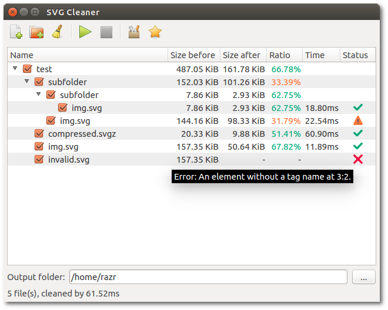
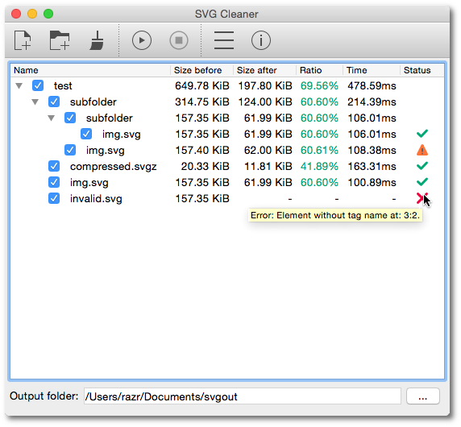

# SVG Cleaner

*SVG Cleaner* is the main GUI for [svgcleaner](https://github.com/RazrFalcon/svgcleaner).

### Brief

This GUI adds support for:

 - Batch files processing.
 - Parallel cleaning jobs.
 - SVGZ decompression and compression via [7-Zip](http://www.7-zip.org/) and
   [Zopfli](https://github.com/google/zopfli).
 - Tooltip with brief help for each cleaning option.

### Screenshots



\* application uses default theme on Linux



\* cleaning time is big because screenshots were taken in VM.

### Build dependencies

**OS**: Linux, macOS, Windows

**Libraries**: Qt 5

#### Building

```bash
qmake
make
# optional for Linux
make install
```

### Runtime dependencies

 - 7za(.exe)
 - svgcleaner(-cli)
 - zopfli (optional)

#### Notes
 - This is only a GUI. You have to build [svgcleaner](https://github.com/RazrFalcon/svgcleaner) separately.
 - On Windows and macOS you should rename `svgcleaner` (CLI) executable to `svgcleaner-cli`.

### Usage notes

 - Time in folder item is just a sum of children items. It's not a total time spend for
   cleaning since it doesn't count that we can use parallel jobs.
 - If an input file is SVGZ and output SVG you probably will get a negative cleaning ratio.

### Roadmap

V0.7.0

 - [ ] Translations.
 - [ ] Multipass.

V0.8.0

 - [ ] Find different icon theme. I'm not a fan of a flat design...
 - [ ] Compare images via WebKit.

### Icons

 - Icons in the title bar are from KDE Breeze theme.
 - Other icons are handcrafted.

### License

*SVG Cleaner* is licensed under the [GPL-2.0](https://www.gnu.org/licenses/old-licenses/gpl-2.0.en.html).
